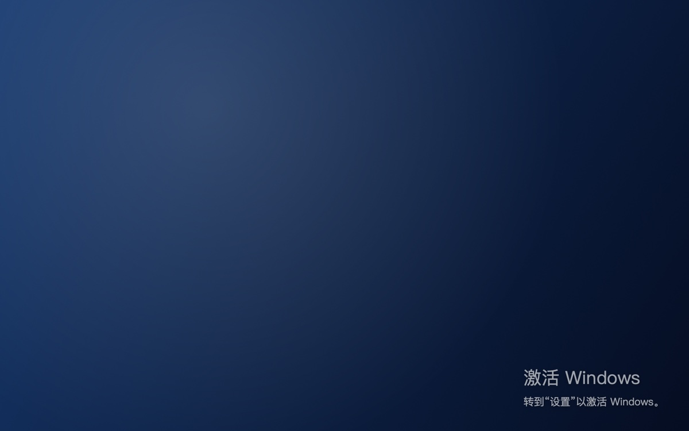
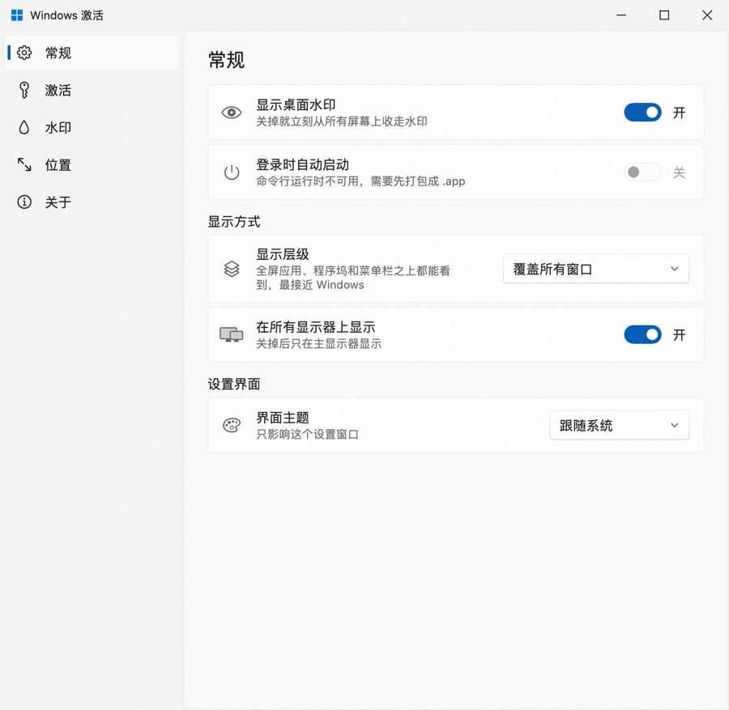
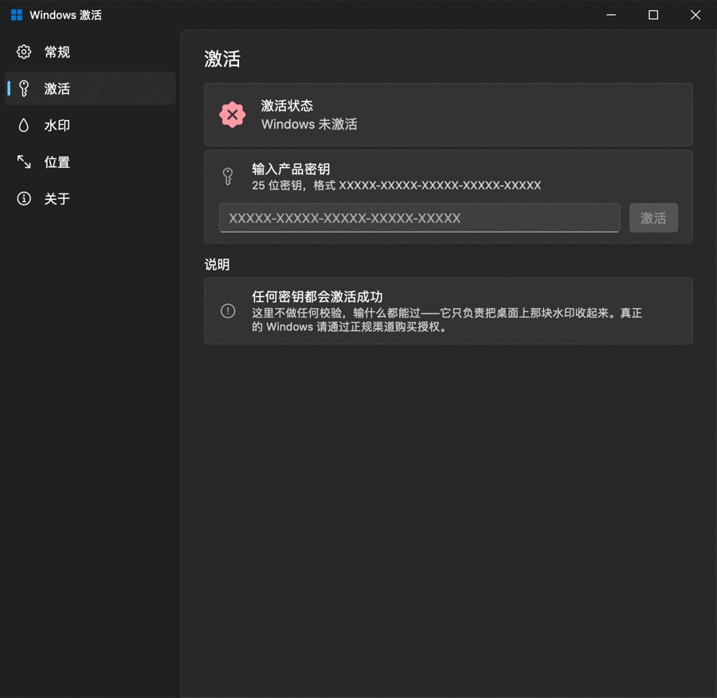
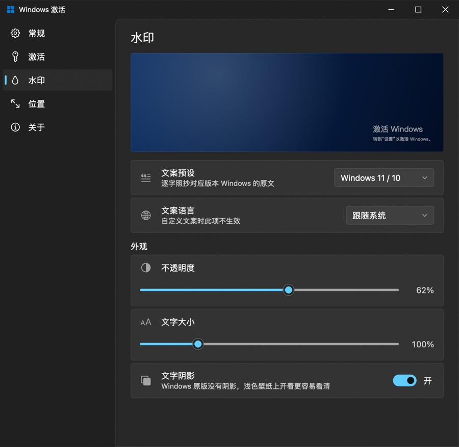
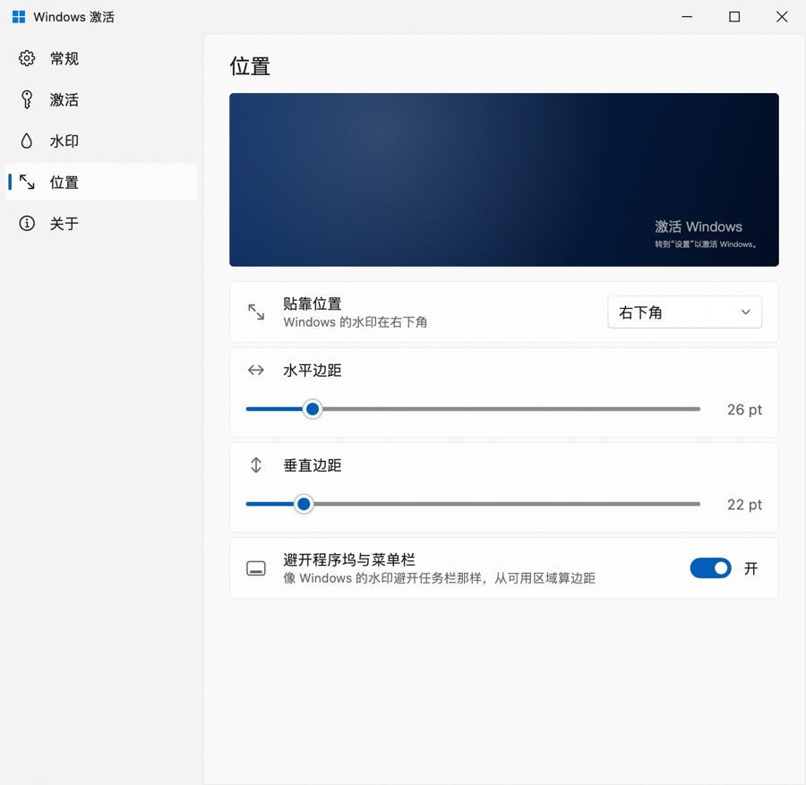

# Windows 激活（Windows-Activate-for-macOS）

把 Windows 那块“激活 Windows”水印搬到 macOS 桌面右下角，并且不管你在用哪个应用、切到哪个桌面、甚至全屏看视频，它都在。界面按 WinUI（Windows 11 Fluent）来做：标题栏是 Windows 的排布，**最小化 / 最大化 / 关闭在右上角，用 ─ □ ✕，不是 macOS 的红绿灯**。

水印上写着“转到‘设置’以激活 Windows。”——照做真的能激活：设置里有一页**卡密激活**，随便输什么密钥都会成功，水印随即消失。



> [!NOTE]
> 这是个玩笑 / UI 练习项目：它只是在桌面上叠了一层透明、不接收鼠标事件的覆盖窗口，**不修改系统，也和任何激活、破解行为无关**。所谓“卡密激活”只是把自己画的水印收起来而已。

## 特性

- **水印覆盖层**：透明面板 + 鼠标穿透，跟随所有桌面空间，可以盖在全屏应用、程序坞和菜单栏之上
- **卡密激活**：Windows 11 设置里那套激活页——激活状态卡片、25 位密钥输入框（自动补连字符）、假装联网校验的等待动画。任何密钥都能通过，激活后水印收起，还能一键取消激活把它放回来
- **文案还原**：简体中文与英文两套预设，逐字对应 Windows 11 / 10 的“激活 Windows”和 Windows 7 的“此 Windows 副本不是正版”，也能自己写
- **可调**：位置（四个角）、边距、不透明度、字号、文字阴影、是否避开程序坞、单屏 / 多屏、覆盖层级
- **WinUI 设置窗口**：Mica 背景、左侧导航面板、Fluent 配色与控件（开关、滑块、下拉框、输入框、设置卡片），支持浅色 / 深色
- **常驻菜单栏**：四格 Windows 徽标图标，可随时开关水印、取消激活或呼出设置（⌘,）
- **开机自启**：通过 `SMAppService` 注册登录项

| 常规 | 激活 |
| --- | --- |
|  |  |
| 水印 | 位置 |
|  |  |

## 环境要求

- macOS 14 或更新（开发环境为 macOS 26 + Xcode 26）
- Swift 6.0 及以上工具链（用 Swift 5 语言模式编译）

## 快速开始

```bash
# 直接跑（命令行运行时不带 .app 包，开机自启不可用）
swift run

# 打包成可双击的 .app（顺手生成图标并做临时签名）
./Scripts/build-app.sh
open dist/WindowsActivate.app

# 想装到“应用程序”里
cp -R dist/WindowsActivate.app /Applications/
```

首次启动会自动打开设置窗口。之后从菜单栏的四格图标进入设置，或者按 ⌘, 。

其他命令：

```bash
swift test                                   # 单元测试
swift build && .build/debug/WindowsActivate --snapshot Snapshots   # 离屏渲染界面截图
./Scripts/build-app.sh --universal           # arm64 + x86_64
```

## 设置项

| 分页 | 设置 | 说明 |
| --- | --- | --- |
| 常规 | 显示桌面水印 | 关掉立刻从所有屏幕移除；已激活时此开关不可用 |
| 常规 | 登录时自动启动 | 需要以 `.app` 形式运行 |
| 常规 | 显示层级 | 覆盖所有窗口 / 浮于普通窗口之上 / 贴在桌面壁纸上 |
| 常规 | 在所有显示器上显示 | 关掉后只留主显示器 |
| 常规 | 界面主题 | 只影响设置窗口，跟随系统 / 浅色 / 深色 |
| 激活 | 输入产品密钥 | 任何密钥都会激活成功，激活后水印消失、状态记进配置 |
| 激活 | 取消激活 | 把水印放回桌面（菜单栏图标里也有这一项） |
| 水印 | 文案预设 / 语言 | Windows 11 / 10、Windows 7、自定义 |
| 水印 | 不透明度 / 文字大小 / 文字阴影 | Windows 原版没有阴影，浅色壁纸上建议开着 |
| 位置 | 贴靠位置 / 水平边距 / 垂直边距 | 默认右下角，26 pt / 22 pt |
| 位置 | 避开程序坞与菜单栏 | 像 Windows 水印避开任务栏那样，从可用区域算边距 |

## 项目结构

```
Sources/
  WindowsActivate/            可执行入口（只负责引导）
  WindowsActivateKit/
    Model/                   设置模型、文案预设、位置计算、激活状态、持久化
    Watermark/               覆盖窗口、水印视图、多屏管理
    WinUI/                   WinUI 设计系统：配色、字号、控件、标题栏按钮
    Settings/                设置窗口与常规 / 激活 / 水印 / 位置 / 关于五个分页
    App/                     应用主控、菜单栏图标、主菜单
    Support/                 字体回退、开机自启、离屏截图
Tests/WindowsActivateKitTests/
Scripts/                     打包与图标脚本
```

几个实现上的关键点：

- 覆盖层是 `NSPanel`（`.borderless` + `.nonactivatingPanel`），`ignoresMouseEvents = true`，`collectionBehavior` 带 `.canJoinAllSpaces`、`.fullScreenAuxiliary`；“覆盖所有窗口”用的是 `.screenSaver` 层级
- 设置窗口是无边框窗口，标题栏完全自绘。系统的标题栏附件（`NSTitlebarAccessoryViewController`）会在边上留出约 18 pt 间距，按钮贴不到窗口角上，所以没有采用
- 水印显示与否由 `WatermarkSettings.showsWatermark` 决定（开关打开 **且** 未激活），激活状态和其他设置一起存在 `UserDefaults`
- 字体优先 Segoe UI（装了 Office 的 Mac 通常有），否则回落系统字体；中文补一条 Microsoft YaHei → PingFang 的字形回退链
- SwiftUI 的 `Menu`、`TextField` 无法离屏渲染，所以下拉框改成自绘控件 + 原生 `NSMenu`，输入框在生成截图时用静态文本占位

## 已知取舍

- “覆盖所有窗口”层级会压在下拉菜单、程序坞之上——Windows 的水印同样如此。介意的话切到“浮于普通窗口之上”
- 设置界面文案只有简体中文；水印文案本身可以切成英文
- 临时签名（ad-hoc）的 `.app` 首次打开可能被 Gatekeeper 拦，右键“打开”即可
- 水印会被截图和录屏拍到，这也是 Windows 的行为

## 许可证

[自定义许可协议](LICENSE)：源码著作权归作者所有，**允许二次分发（含修改后的版本），但禁止商业使用**。分发时请保留协议全文与出处，并标明修改。个人学习、研究、教学与非营利用途不受限制。

“Windows” 与 Windows 徽标是 Microsoft Corporation 的商标，本项目与 Microsoft 无任何隶属或背书关系。
